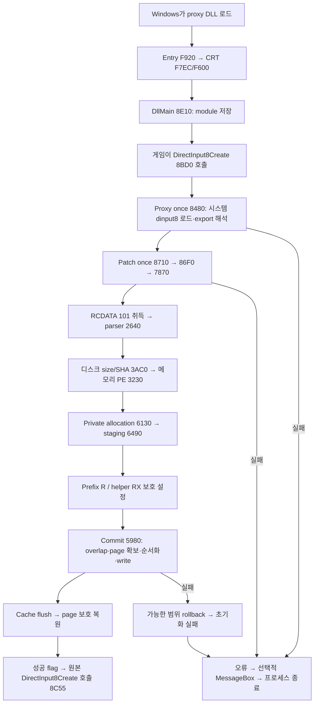

# PC runtime reverse engineering — staged master

## 운영 상태

- PHASE 1 완료: DLL 로딩, 초기화, EXE 검증, patch transaction framework.
- PHASE 2 이후: 미착수. 사용자의 새로운 `진행` / `ㄱㄱ` / `시작` 신호 전에는 진행하지 않는다.
- 단계 완료 시 이 문서에 누적하고, 검증 원장·상태·changelog를 갱신한 문서 커밋 후 STOP한다.
- PHASE 1~5에서는 Switch counterpart 조사, ARM64, IPS, 빌드 생성을 하지 않는다.
- 기존 `PC_RUNTIME_DLL_SPEC.md`의 확정 사실은 재사용한다. 아래는 PHASE 1의 주소 근거와 예외 처리를 구체화한 기록이다. 기존 문서의 후속 주제는 이번에 재분석하지 않았다.

## PHASE 1 — 2026-09-11

### 1. 요약 및 증거 기준

`DllMain`은 패치를 적용하지 않는다. `DirectInput8Create` proxy가 시스템 DLL을 준비한 뒤 별도의 once guard로 한글패치를 초기화한다. T5K 파싱 → 디스크 EXE identity → 메모리 PE profile → private storage 준비 → 전체 staging → private storage 보호 설정 → EXE transaction commit 순서이며, 성공 후에만 원래 `DirectInput8Create`를 호출한다.

실패 시 부분 패치를 건너뛰고 계속 실행하는 구조가 아니다. 정상 오류 경로에서는 오류를 기록하고 프로세스를 종료한다. Rollback은 구현되어 있지만 모든 복원 API의 성공을 검사하지 않으므로 완전한 원자성·복원 보장을 의미하지 않는다.

| 항목 | 분석 기준 |
|---|---|
| 시작 remote main | `06a787a6d4743ed4a64a8672450895c99bc8a0fe` — 실제 remote 확인 후 별도 정상 checkout에서 작업 |
| 패치 ZIP | `Taiko5DX_Korean_Patcher_v1.02`; SHA-256 `df1b62de95e992369e9686c9731d814e7a7e4634888f610430635429e24f7cec` |
| DLL | 836,096 bytes; SHA-256 `ffe7e9da8e00c96bec631b45a3e9c4d3f314551623351f3e7024e0318913c6b7` |
| T5K | 기존 V004/V005 및 `PC_RUNTIME_DLL_SPEC.md`의 고정 identity·수량 재사용; 재계수하지 않음 |
| 정확한 target EXE | Steam 1.2.1.0 build 9163702; 18,685,960 bytes; SHA-256 `10c69bab50d29baf6311360cafbf7383716a126a6484d209f5e299e12ab565a2`; 분석 입력으로 미확보 |
| 방법 | 원본 DLL의 PE directory/import/export/unwind metadata 및 필요한 x86-64 함수만 정적 해석. 실행·수정·실기 테스트 없음 |
| 주소 규칙 | 아래 함수/호출 주소는 모두 **DLL RVA**. VA = 실제 DLL load base + RVA. EXE header의 비교 상수는 명시적으로 별도 표기 |
| 재현 | 동일 해시 DLL을 PE/x86-64 분석기에 열고 아래 함수 및 IAT 호출을 따라간다. PDB 이름 없는 함수의 역할 이름은 분석용 이름이며 원래 symbol 이름으로 주장하지 않는다 |

### 2. PE 기본 구조

- Machine `0x8664` (AMD64), PE32+ x86-64 DLL.
- Preferred ImageBase `0x180000000`; entry RVA `0xF920`.
- TLS directory RVA/size 모두 0: PE TLS callback 등록 없음. CRT의 TLS/FLS API import는 TLS callback 존재의 증거가 아니다.
- Export는 6개이며 모두 DLL 내부 코드 RVA이다. PE export forwarder 문자열은 없다.

| Section | RVA | VirtualSize | RawSize | Characteristics |
|---|---:|---:|---:|---:|
| `.text` | `0x1000` | `0x24BAB` | `0x24C00` | `0x60000020` RX |
| `.rdata` | `0x26000` | `0xDDAE` | `0xDE00` | `0x40000040` R |
| `.data` | `0x34000` | `0x1C8C` | `0xC00` | `0xC0000040` RW |
| `.pdata` | `0x36000` | `0x1EFC` | `0x2000` | `0x40000040` R |
| `.fptable` | `0x38000` | `0x100` | `0x200` | `0xC0000040` RW |
| `.rsrc` | `0x39000` | `0x95D98` | `0x95E00` | `0x40000040` R |
| `.reloc` | `0xCF000` | `0x6A4` | `0x800` | `0x42000040` R/discardable |

Import modules는 `KERNEL32.dll`, `bcrypt.dll`, `USER32.dll`, `SHELL32.dll`, `ole32.dll`이다. PHASE 1 관련 API는 다음과 같다. 나머지 CRT 지원 import의 개별 내부 동작은 이번 범위가 아니다.

| 계층 | 실제 import |
|---|---|
| Proxy/초기화 | `GetSystemDirectoryW`, `LoadLibraryExW`, `GetProcAddress`, `InitOnceExecuteOnce`, `DisableThreadLibraryCalls` |
| Resource | `FindResourceW`, `LoadResource`, `SizeofResource`, `LockResource` |
| EXE identity | `GetModuleFileNameW`, `CreateFileW`, `GetFileSizeEx`, `ReadFile`, `GetModuleHandleW` |
| SHA-256 | `BCryptOpenAlgorithmProvider`, `BCryptGetProperty`, `BCryptCreateHash`, `BCryptHashData`, `BCryptFinishHash`, `BCryptDestroyHash`, `BCryptCloseAlgorithmProvider` |
| Memory transaction | `GetSystemInfo`, `VirtualQuery`, `VirtualAlloc`, `VirtualProtect`, `VirtualFree`, `GetCurrentProcess`, `FlushInstructionCache` |
| 오류/로그 | `GetLastError`, `FormatMessageW`, `GetEnvironmentVariableW`, `SHGetKnownFolderPath`, `CoTaskMemFree`, `CreateDirectoryW`, `GetLocalTime`, `WriteFile`, `CloseHandle`, `MessageBoxW`, `TerminateProcess`, `ExitProcess` |

### 3. Loader, proxy, 초기화 guard

| 지점 | 확정 동작 |
|---|---|
| Entry `0xF920` | Process attach에서 CRT security 초기화 `0xFF14`; `0xF958`에서 CRT dispatcher `0xF7EC`로 이동 |
| `0xF7EC` | Attach CRT 처리 `0xF600`을 거쳐 `0xF871`에서 사용자 DllMain `0x8E10` 호출 |
| DllMain `0x8E10` | `edx == 1`일 때 모듈 handle을 global `0x35C58`에 저장하고 `0x8E20`에서 `DisableThreadLibraryCalls`. 모든 정상 반환은 TRUE. 패치/시스템 DLL 로딩 호출 없음 |
| DirectInput8Create `0x8BD0` | 원래 5개 인수를 보존. `0x8C11`에서 proxy once, `0x8C2F`에서 patch once 수행 |
| Proxy once | global `0x35C40`, callback `0x8480`. 시스템 DLL export 6개가 전부 해석되어야 TRUE |
| Patch once | global `0x35C68`, callback `0x8710` → `0x874C`에서 SEH wrapper `0x86F0` → `0x86F4`에서 실제 초기화 `0x7870` |
| 결과 flag | `0x86F9`에서 초기화 AL을 global byte `0x35C48`에 저장. SEH handler `0x8703`에서는 0으로 설정 |
| Callback 결과 | `0x8710`은 오류 logging을 거친 뒤 `0x8A93`에서 TRUE 반환. once 완료 여부와 patch 성공 여부는 별도이다 |
| 원본 함수 호출 | `0x8C35`에서 성공 flag 검사. TRUE일 때만 `0x8C55`에서 원래 함수 포인터 호출. 반환값은 호출자에게 전달 |

`0x86F0`의 unwind scope는 `[0x86F4,0x8703)` 및 handler `0x8703`을 지정한다. 이는 초기화 중 SEH 오류를 실패 상태로 바꾸는 증거이다. 모든 예외 상황에서 자원 정리가 완벽하다는 주장은 하지 않는다.

| Ordinal | Export | RVA | 한글패치 초기화 |
|---:|---|---:|---|
| 1 | `DirectInput8Create` | `0x8BD0` | 시스템 proxy 준비 후 patch once 실행 |
| 2 | `DllCanUnloadNow` | `0x8CA0` | 없음; proxy once 후 전달 |
| 3 | `DllGetClassObject` | `0x8CE0` | 없음; proxy once 후 전달 |
| 4 | `DllRegisterServer` | `0x8D50` | 없음; proxy once 후 전달 |
| 5 | `DllUnregisterServer` | `0x8D90` | 없음; proxy once 후 전달 |
| 6 | `GetdfDIJoystick` | `0x8DD0` | 없음; proxy once 후 전달 |

시스템 DLL 경로: `0x84C0 GetSystemDirectoryW` → `\\dinput8.dll` 결합 → `0x857F LoadLibraryExW(path, NULL, 0x800)`. 현재 게임 폴더의 DLL을 다시 찾는 단순 basename 로딩이 아니다. 경로 조회 결과가 0 또는 버퍼 한계 이상이면 실패한다. `0x859F..0x8626`에서 6개의 `GetProcAddress`를 수행하며 하나라도 NULL이면 callback 실패.

DirectInput8Create의 시스템 DLL 초기화 실패는 fatal이다. 다른 4개 HRESULT export는 proxy 준비 실패 시 `0x80004005`, GetdfDIJoystick은 NULL 반환한다. 따라서 “모든 export 실패가 즉시 강제 종료”라고 일반화하면 안 된다.

**미확정:** 정확한 게임 EXE가 없으므로 게임이 이 proxy를 일반 import, delay import, 명시적 LoadLibrary 중 무엇으로 처음 로드하는지 및 게임 측 최초 호출 RVA는 확정하지 않는다. 아래 흐름은 Windows가 이 DLL을 로드하고 DirectInput8Create를 호출한 조건에서 DLL 자체가 보장하는 흐름이다.

### 4. T5K 취득과 validation 시작

| 초기화 함수 `0x7870` 내부 호출 | 동작 |
|---|---|
| `0x7974` | `FindResourceW(savedDllModule, 101, RT_RCDATA=10)` |
| `0x7A08` | `LoadResource` |
| `0x7A1B` | `SizeofResource` |
| `0x7A26` | `LockResource` |
| `0x7A2C..0x7A41` | load handle/locked pointer의 NULL 및 resource size `<0x48` 거절 |
| `0x7A57` | `{pointer,size}`를 parser `0x2640`에 전달 |
| Parser `0x2718..0x2764` | magic `T5K121R\0`, version 1, 고정 record 수 및 prefix/helper 크기 검사 |
| Parser `0x3022` | 파싱 완료 후 남은 바이트가 있으면 실패 |

Resource 자체는 DLL RVA `0x39060`에서 시작한다. Resource 구조 검사 후에 디스크 EXE identity를 검사한다. Parser의 개별 mapping/pointer/descriptor 포맷·의미는 후속 단계이며 이번에는 진입점과 실패 전파만 기록한다. 파싱 실패는 `0x7A5E`에서 공통 실패 cleanup으로 이동하고 commit에 진입하지 않는다.

### 5. Target EXE identity — 서로 다른 두 검사

**디스크 파일 검사:** `0x7AD8` → `0x3AC0`.

1. `0x3B53 GetModuleFileNameW(NULL, ..., 0x8000)`로 실행 중인 main EXE의 경로를 얻는다. 실패/길이 초과 거절.
2. 마지막 역슬래시 뒤 basename을 `Taiko5DX.exe`와 비교한다 (`0x3B6E`, `0x3B88`). 비교 routine `0x17960`/`0x17900`은 ASCII 대문자를 소문자로 정규화하는 대소문자 무시 비교이다.
3. `0x3BFB`에서 파일 검사 함수 `0x34D0`. `0x3532 CreateFileW`로 읽기 열기 후 `0x35B4 GetFileSizeEx` 수행.
4. `0x35FC`에서 BCrypt `SHA256` 공급자, `0x362D` object length, `0x3796` hash object 생성. `0x3814/0x3857 ReadFile`과 `0x3837 BCryptHashData`로 최대 1 MiB씩 EOF까지 해시한다. `0x3918 BCryptFinishHash`의 출력은 32 bytes.
5. 함수 반환 후 `0x3C51..0x3C5A`에서 파일 크기와 T5K header `+0x20`의 u64를 비교한다. 같으면 `0x3C6B`에서 32-byte hash와 header `+0x28`을 비교한다.

따라서 실제 순서는 **파일 크기 취득 → 파일 전체 SHA 계산 → 기대 크기 비교 → 기대 hash 비교**이다. 기대 크기 불일치만으로 해시 전에 조기 중단한다고 설명하면 틀린다. 파일 버전 문자열이나 Steam build ID를 API로 조회하는 검사는 이 identity 경로에 없다. 지정 build는 고정 size/hash로 식별한다.

**메모리 PE 검사:** 디스크 검사 성공 후 `0x7B6E` → `0x3230`.

| 조건 | DLL 검사 RVA | 기대 값 |
|---|---:|---|
| Main module | `0x324B` | `GetModuleHandleW(NULL)` 성공 |
| DOS signature/e_lfanew | `0x32C6..0x32DB` | MZ, e_lfanew > 0 |
| NT signature | `0x32E1` | `PE\0\0` |
| OptionalHeader.Magic | `0x32F3..0x32FD` | `0x20B` (PE32+) |
| Header.ImageBase | `0x3303..0x3311` | `0x140000000` |
| SizeOfImage | `0x3317` | `0x2726000` |
| `.text` section | `0x3358..0x33B8` | 이름 `.text`, RVA `0x1000`, VirtualSize `0xAFF0B1` |

위 EXE 값들은 **DLL이 비교하는 상수**로 확정한 것이며, 미보유 정확한 EXE의 header를 실측했다고 주장하지 않는다. Header.ImageBase 검사는 실제 load base를 고정하는 검사가 아니다. 성공 시 actual module base, image size, actual text pointer/RVA/size를 image-info 구조에 저장한다 (`0x33BA..0x33DC`). 디스크 SHA는 메모리 이미지 전체의 hash 검증이 아니다.

각 실패는 오류 문자열을 설정하고 FALSE를 상위로 전달한다. EXE 쓰기 전 단계이므로 이 검사 실패를 record별 skip으로 처리하지 않는다.

### 6. Private storage와 staging 경계

- `0x7BA5` → `0x6130`: 저장 공간 준비.
- 페이지 크기로 prefix/helper 크기를 각각 올림한 뒤 **합쳐 하나의 연속 allocation**을 만든다. 두 영역이 별도 VirtualAlloc이라는 의미가 아니다.
- `0x6238 VirtualQuery`로 main image 뒤쪽의 MEM_FREE 후보를 탐색한다. 상한은 actual EXE base + `0x70000000` 및 시스템 최대 application address 중 작은 값이다. Allocation granularity에 맞춘 후보를 사용한다.
- `0x6292 VirtualAlloc(candidate, total, 0x3000, 4)`: MEM_RESERVE|MEM_COMMIT, PAGE_READWRITE. 임의의 먼 주소에 fallback allocation하는 경로는 이 함수에 없다.
- `0x6324`, `0x6335`: resource prefix와 helper를 각 영역에 복사. `0x633A..0x63D3`는 helper 상대 주소 fixup/범위 검사 경계이다. 그 개별 operand 및 helper 의미는 후속 단계.
- 준비 실패 시 FALSE. Fixup 실패 후에는 `0x6445 VirtualFree(...,0,MEM_RELEASE)` 후 반환 포인터를 NULL로 만든다.
- `0x7BEF` → `0x6490`: 전체 패치 staging. 이 함수의 개별 recipe 생성 의미는 후속 단계이다. 공통 staging 함수 호출은 `0x68C0`, `0x6D33`, `0x72FD`; 마지막 overlap 검사 호출은 `0x73DA`.
- Staging 성공 후 `0x7C49`에서 prefix 영역을 PAGE_READONLY(2), `0x7CC4`에서 helper 영역을 PAGE_EXECUTE_READ(0x20)로 변경한다. 둘 다 성공해야 commit으로 이동한다.
- Staging/최종 보호/commit 실패의 정상 반환 경로는 `0x7D44`에서 allocation을 해제한다. 성공 시 allocation은 런타임 참조를 위해 유지된다.

### 7. 공통 patch record와 preimage guard

공통 staging 함수 `0x49C0`:

- 기대 원본 길이 > 0, replacement 길이 동일인지 검사 (`0x4A02..0x4A19`).
- 대상 실제 메모리와 기대 원본을 비교 (`0x4A2B` → 비교 routine `0x24FD0`). mismatch면 오류를 기록하고 FALSE. 이미 replacement가 써져 있다는 이유로 성공 처리하는 bypass가 없다.
- 성공 시 target, rollback용 원본, replacement, label, priority를 plan에 보관한다 (`0x4B42..0x4CF0`). 게임 메모리에 replacement를 아직 쓰지 않는다.

| Staged entry offset | 보관 항목 |
|---:|---|
| `+0x00` | target VA |
| `+0x08..0x1F` | 원본 byte vector (begin/end/capacity) |
| `+0x20..0x37` | replacement byte vector |
| `+0x38..0x57` | 오류 식별용 wide string label |
| `+0x58` | signed priority; 전체 entry stride `0x60` |

`0x5020`은 target 주소 기준 정렬 후 인접 범위의 겹침을 검사한다 (`0x50A0..0x50AF`). 끝과 다음 시작이 같은 것은 허용하고, 겹치면 실패한다. `0x9D10` 정렬 및 `0xAF90` 비교 경로에 주소/길이 비교가 존재한다. 이 검사는 staging 말미와 commit 초기에 호출된다.

### 8. Commit 및 rollback 명세

Commit entry `0x5980`, 호출 `0x7D30`.

1. `0x59C4` → `0x5020`: plan 정렬/overlap 검사.
2. `0x59F1` → `0x5340`: 대상 범위의 page를 중복 제거하고 쓰기 가능 상태로 만든다. `0x538A GetSystemInfo`; `0x55C4 VirtualProtect(page,pageSize,PAGE_EXECUTE_READWRITE=0x40,&oldProtect)`. 변경된 page와 원래 보호 속성을 저장한다.
3. 변경 중 실패하면 이미 바꾼 page의 보호를 역순 복원 (`0x5756`)하고 FALSE. 이 시점에는 replacement commit이 시작되지 않았다.
4. `0x5A20..0x5ADD`: priority 기준 안정 정렬. `0x9E30`의 `0x9F08/0x9FA0` 및 큰 목록 경로 `0xA130`이 해당 ordering을 수행한다. 공통 staging에 전달되는 priority는 inline=0 (`0x680E`, `0x68A6`), pointer=1 (`0x6D16`), code=2 (`0x72DF`). 실제 쓰기 순서는 inline → pointer → code이다.
5. `0x5B00..0x5B25`: 각 replacement를 `0x5320`으로 copy. `0x5324`에서 내부 byte-copy routine `0x24780` 호출. 외부 memcpy import에 의존하지 않는다. `0x248BD..0x248CB`에 겹치는 메모리의 복사 방향 분기가 있어 memmove형 동작도 지원한다.
6. `0x5320`은 정상 TRUE, SEH handler `0x532D`는 FALSE. Unwind scope `[0x5324,0x532D)` → handler `0x532D`가 근거이다. 부분 copy 후 fault도 발생 가능하므로 실패한 현재 record까지 rollback 대상으로 포함한다.
7. 전체 write 성공 후 `0x5B35 FlushInstructionCache(GetCurrentProcess(),NULL,0)`. 실패하면 전체 rollback `0x5820` 호출 (`0x5BAF`).
8. Flush 성공 후 `0x5E60..0x5E94`에서 page 보호를 역순 복원한다 (`0x5E7A VirtualProtect`). 전부 성공해야 최종 TRUE (`0x6045`).

| 실패 지점 | 대응 | 보장 한계 |
|---|---|---|
| Overlap 또는 staging preimage mismatch | 오류/FALSE; commit 쓰기 안 함 | 다른 record만 적용하는 skip 없음 |
| Writable-page 확보 중 실패 | 이미 변경한 page 보호 역순 복원 | 복원 VirtualProtect 반환값은 검사하지 않음 |
| 개별 copy 실패 | `0x5C72..0x5CBE`에서 처음부터 실패한 현재 record까지의 범위를 구성; `0x5CE0..0x5D0B`에서 원본 역순 copy, cache flush, page 보호 복원 | 원본 copy 실패는 누적 검사하여 오류 문자열에 추가; rollback flush/protect 반환값은 검사하지 않음 |
| Commit 후 cache flush 실패 | `0x5820`으로 전체 원본 역순 copy; cache flush; 보호 복원 | rollback copy 실패 표시; rollback flush/protect 성공 보장 없음 |
| 정상 종료용 보호 복원 실패 | `0x5F31`에서 page를 다시 writable로 확보; 성공하면 `0x5F42` 전체 rollback | 다시 writable 확보도 실패하면 추가 오류를 기록; 완전 복원 보장 불가 |
| 초기화 중 SEH | `0x86F0` wrapper에서 patch success flag=0 | 모든 예외가 transaction rollback을 통과한다고 주장하지 않음 |

`0x5820`의 rollback copy는 `0x585E`, flush는 `0x5890`, 보호 복원은 `0x58C9`이다. Rollback 중 원본 copy 실패는 `; rollback 중 메모리 복원 실패`를 오류 문자열에 붙인다.

보호 확보에서는 GetSystemInfo의 page size를 사용하지만 복원 경로는 길이 `0x1000`을 사용한다. 특히 보호 복원 실패 후 재확보하는 경로는 그 시점의 보호 속성을 다시 저장하므로 최초 보호 상태의 완벽한 재현을 보장한다고 해석하지 않는다.

**Transaction의 의미:** staging과 순서 제어 및 best-effort rollback이다. 메모리 쓰기 전체가 CPU 관점에서 원자적이라는 의미가 아니다. 이 commit 경로에는 원본의 commit 직전 재비교나 다른 게임 thread 정지 절차가 없다. 타 thread 관찰 가능성 및 실제 초기화 시 thread 상태는 미확정이다.

### 9. 오류 및 logging

- 공통 오류 문자열 global은 `0x35A70`이다.
- Logger `0x2020`은 timestamp(`0x208A GetLocalTime`)를 붙이고 `0x2464 CreateFileW`, `0x2497 WriteFile`, `0x24A0 CloseHandle`을 호출한다. 경로 준비 `0x1A50`은 KnownFolder 및 LOCALAPPDATA 경로를 사용하며 `Taiko5DXKoreanPatcher\\Logs\\runtime-loader.log` 구성 문자열이 있다. 파일 로그 API 호출의 존재는 확정; 실제 사용자 환경에서 로그 저장 성공은 미관찰이다.
- 초기화 실패 callback은 `0x8A4D`에서 실패 logging 후 TRUE를 반환하되 patch-success flag는 FALSE로 유지한다.
- DirectInput8Create가 FALSE flag를 읽으면 `0x8C76` → fatal `0x8B30`.
- `0x8B82 GetEnvironmentVariableW(L"TAIKO5DX_KO_NOUI",...)`가 nonzero이면 오류창만 생략한다. 검증 우회나 게임 계속 실행 옵션이 아니다.
- 그 외에는 `0x8BA8 MessageBoxW(...,0x1010)` 후, `0x8BBC TerminateProcess(currentProcess,0xC1)`와 `0x8BC7 ExitProcess(0xC1)` 경로로 종료한다.
- DLL의 정상 patch 오류 처리는 fail-closed이다. 메모리 복원에 실패했더라도 성공으로 승격해 원래 DirectInput8Create를 호출하지 않는다.

### 10. 전체 실행 흐름

그림의 patch-once 실패에는 resource/identity/allocation/staging/최종 보호 실패가 포함된다. **Staging 완료와 실제 EXE 쓰기 완료는 다른 시점**이다. Helper/prefix 복사는 EXE transaction 이전에 private memory에 수행된다.

### 11. 판정과 후속 경계

**확정된 사실:** 위 함수/주소/API/PE metadata에 근거한 초기화 순서, 두 once guard, 별도 success flag, file identity와 memory profile의 분리, 하나의 연속 private allocation, staging preimage guard, priority commit, best-effort rollback, fatal 처리.

**유력한 가설:** 게임 폴더의 proxy가 게임의 DirectInput 의존성을 통해 시작 시 로드된다는 배포 의도는 export 구조가 강하게 지지한다. 그러나 정확한 EXE import/caller를 관찰한 사실은 아니다.

**미확정:** 정확한 EXE의 DLL 로딩 형태와 첫 호출 지점/시각, 실제 ASLR 주소 및 thread 상태, 실행 중 성공/실패 로그, rollback 실패 시 실제 메모리 상태. DLL 정적 분석만으로 이들을 실측했다고 하지 않는다.

**기각된 가설:** DllMain에서 한글패치 적용; PE export-forwarder만 있는 DLL; TLS callback이 patch 시작점; EXE version 문자열만으로 승인; mismatch record를 skip하고 계속 실행; 항상 성공하는 완전 원자적 rollback; NOUI가 검증/종료를 우회; prefix/helper를 반드시 두 번 따로 VirtualAlloc한다는 해석. 또한 모든 export가 patch 초기화를 시작하거나 실패 시 모두 프로세스를 종료한다는 일반화는 기각한다.

**관련 영향 범위:** PC 런타임 전체의 초기화 및 실패 처리 기준이다. 개별 한국어 문자/이름 누락 원인이나 Switch 대응 위치를 판정하지 않는다.

**후속 단계 TODO만:** parser `0x2640`, recipe staging dispatcher `0x6490`, private helper 준비의 fixup 경계 `0x633A..0x63D3`. Mapping/pointer/descriptor/helper의 개별 의미는 사용자 승인 후 후속 단계에서 다룬다. 기존 `PC_RUNTIME_DLL_SPEC.md`의 이미 확정된 항목부터 재사용하며 이름/수량을 다시 추측하거나 재계수하지 않는다.

**STOP:** PHASE 1 문서 커밋 완료 후 새로운 실행 신호를 기다린다. 이 기록은 후속 분석·구현 승인이 아니다.
